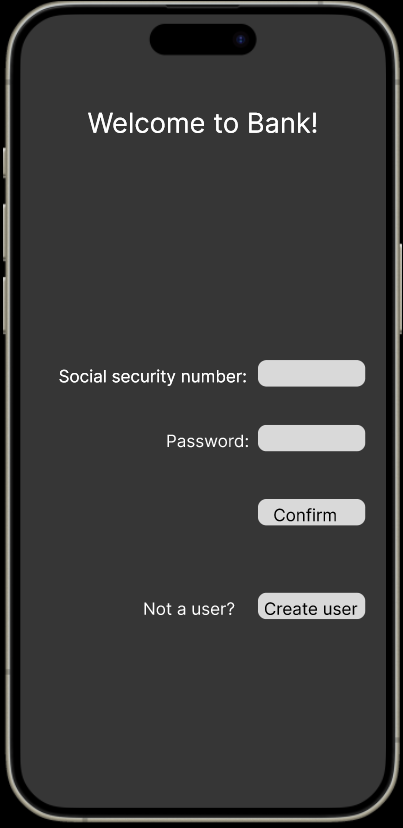
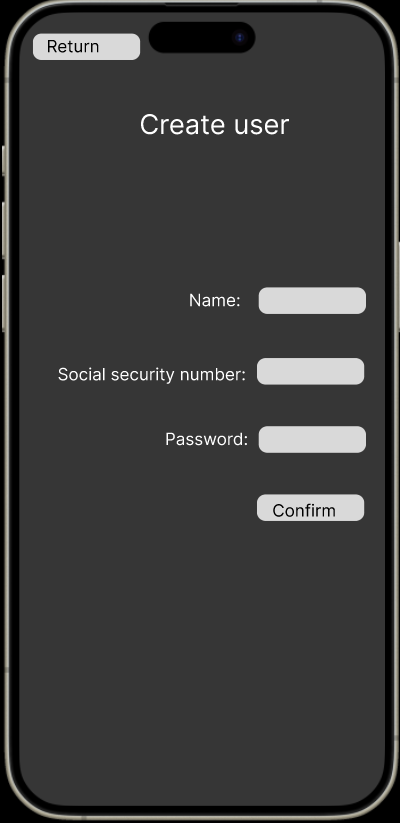
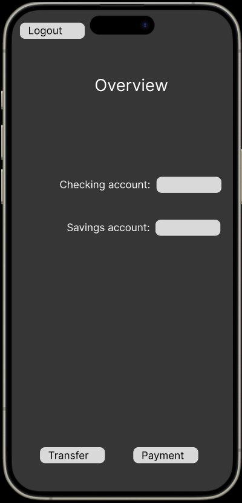
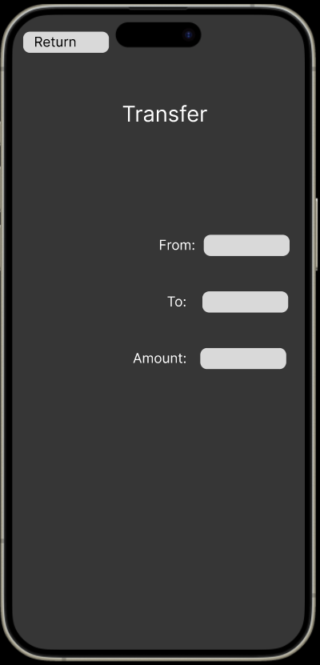
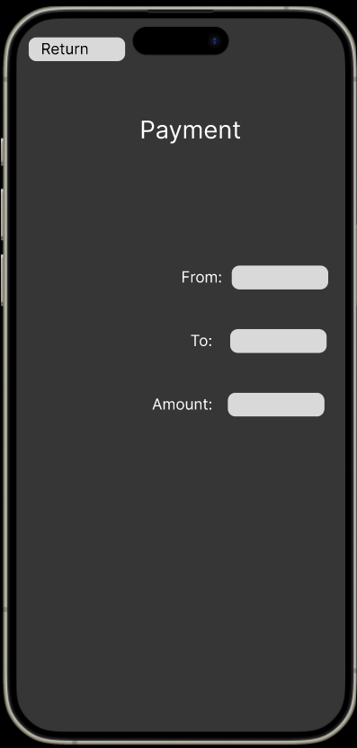

## Bank™

Dette er en app som skal gjøre det lett for brukere å få oversikt over bankkontoer og håndtere banktjenester hos Bank™. 

## Innlogging og registrering

Eksisterede brukere kan enkelt logge inn med fødselsummer og passord for å få tilgang til sine kontoer. Dersom man er ny bruker kan man enkelt registrere seg i appen. 

## Oversikt

Etter innlogging får brukerne en oversikt over sine kontoer og saldoen på dem, slik at de alltid har kontroll over sin økonomi.

## Overføring

Brukerne kan enkelt overføre penger mellom sine egne kontoer. 

## Returnerende bruker

Appen støtter betaling av regninger og andre utgifter direkte fra brukernes kontoer, slik at betalinger kan gjøres raskt og enkelt.
