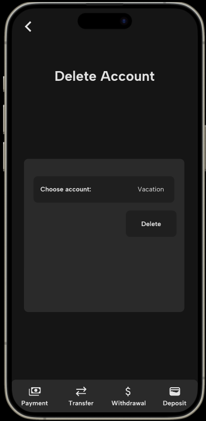
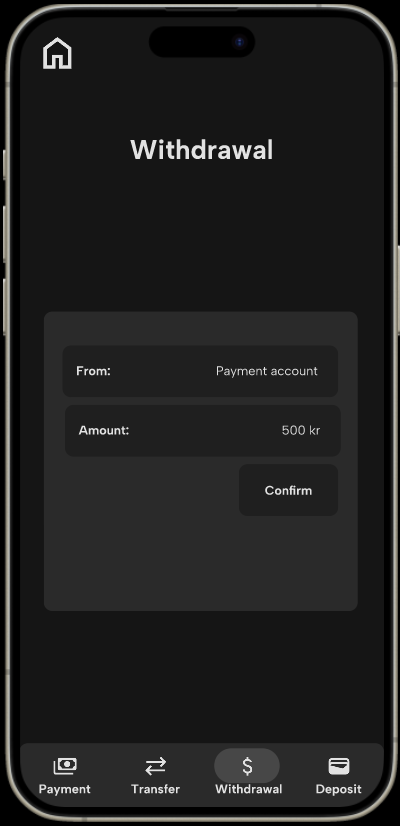
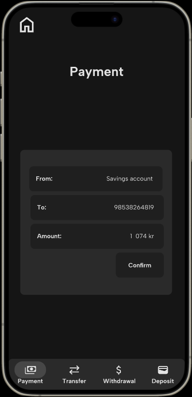

## BankFX

Dette er en app som skal gjøre det lett for brukere å få oversikt over bankkontoer og håndtere banktjenester hos Bank™. Nedenfor er en oversikt over appens funksjonalitet. Se også [`user_stories.md`](../user_stories.md).

## Innlogging og registrering

Eksisterede brukere kan enkelt logge inn med fødselsummer og passord for å få tilgang til sine kontoer. Dersom man er ny bruker kan man enkelt registrere seg i appen. Tilbake-knappen tar brukeren tilbake til startskjermen. Denne knappen er dynamisk og vil ha ulik funksjon og ikon avhengig av hvor man er i appen. 

## Oversikt og kontoer

Etter innlogging får brukerne en oversikt over sine kontoer og saldoen på dem, slik at de alltid har kontroll over sin økonomi. 

I menyen nederst kan brukeren velge mellom betaling, overføring, uttak og innskudd. 

Øverst i venstre hjørnet er det en knapp for å logge ut. Knappen vil endres til en tilbake-knapp eller hjem-knapp dersom brukeren har navigert seg videre. 

I høyre hjørnet er det en knapp for å refreshe innholdet i oversikten. Denne er nyttig å bruke for eksempel dersom en annen bruker har betalt penger til deg mens du allerede er innlogget. Ved å refreshe vil du da kunne se oppdatert saldo.

Det er også knapper for sletting av bruker, samt oppretting og sletting av kontoer. 

## Uttak og innskudd

Brukeren kan registrere innskudd til konto eller uttak fra konto i appen. Da velger man hvilke konto det gjelder vha. en nedtrekksmeny, og skriver inn beløpet. 

## Betaling og overføring

Brukerne kan enkelt overføre penger mellom sine egne kontoer. Da velger man kildekonto og målkonto vha. nedtrekksmeny. 

Appen støtter også betaling til eksterne kontoer (kontoer hos andre brukere) direkte fra brukernes kontoer, slik at betalinger kan gjøres raskt og enkelt. Målkontoen vil da ikke være en nedtrekksmeny, men heller et tekstfelt hvor man skriver inn kontonummer til den eksterne kontoen. 