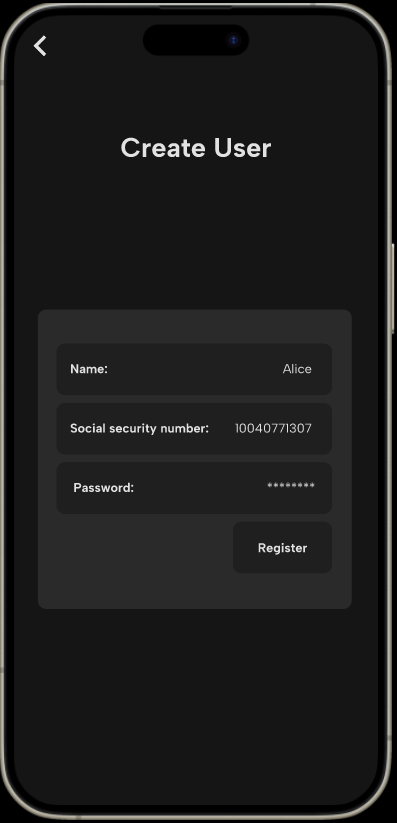
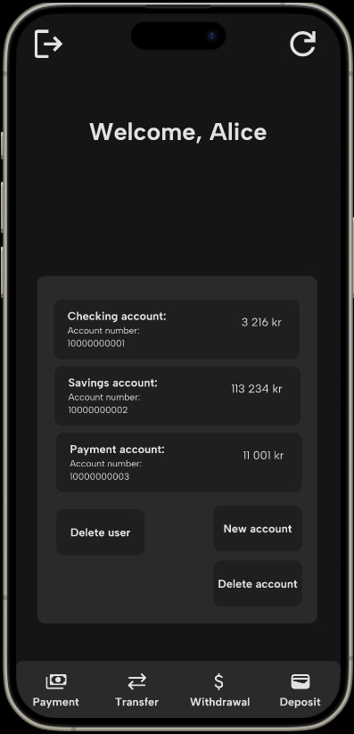

# Brukerhistorier

Brukerhistoriene nedenfor er korte beskrivelser av funksjonalitet sett fra brukerens perspektiv. Ved å beskrive hva en bruker ønsker å oppnå, hvordan de forventer å kunne bruke systemet, og hva som er viktig for dem å se og gjøre, har vi utviklet løsninger som bedre oppfyller deres forventninger.

## Ny kunde (us-1)

Som privatperson ønsker jeg å etablere et nytt kundeforhold med banken. 

Brukeren er ikke en allerede eksisterende kunde av banken og ønsker derfor å registrere seg som ny kunde. Brukeren må derfor kunne registrere fødselsnummer, navn og passord, slik at bruker lett kan logge seg inn i nettbanken senere. 

### Viktig å kunne se
- knapp for å registrere ny bruker
- felt for å registrere seg med fødselsnummer, navn og passord
- skjerm for å logge inn på eksisterende bruker med fødselsnummer og passord

### Viktig å kunne gjøre
- registrere fødselsnummer og passord
- logge inn på allerede eksisterende bruker

## Ny brukskonto og sparekonto (us-2)

som privatperson ønsker jeg å kunne ha en måte å holde styr på pengene mine. 

Brukeren har allerede registrert seg som bruker og ønsker nå å kunne opprette en sparekonto og en brukskonto med navn og type, som brukeren enkelt kan finne frem til senere. 

### Viktig å kunne se:
- knapp for å lage ny spare-/brukskonto
- oversikt over allerede eksisterende kontoer, med saldo og kontonummer

### Viktig å kunne gjøre:
- registrere ny spare-/brukskonto

## Innskudd og uttak (us-3)
Som en bruker ønsker jeg å kunne adminstrere saldoene på kontoene mine. 

Brukeren er allerede kunde i banken, men ønsker nå å kunne registrere inntak eller uttak av penger på kontoene sine. 

### Viktig å kunne se: 
- Knapper for innskudd og uttak
- Valg av konto
- Oppdatert saldo i oversikten

### Viktig å kunne gjøre: 
- Gjøre innskudd på konto
- Gjøre uttak fra konto

## Betaling og overføring av penger (us-4)
Som en bruker ønsker jeg å kunne overføre penger.

Brukeren er allerede kunde i banken og ønsker nå å overføre penger til egne eller eksterne kontoer raskt og sikkert for å gjennomføre betalinger og overføringer effektivt.

### Viktig å kunne se:
- Knapper for å overføring og betaling
- Valg av egen konto og evt. ekstern konto
- Oppdatert saldo i oversikten

### Viktig å kunne gjøre:
- Overføre penger mellom egne kontoer
- Betale penger til ekstern konto

## Slette konto eller bruker (us-5)
Som en bruker ønsker jeg å kunne slette en konto eller min egen brukerprofil. 

Brukeren er kunde hos banken og har opprettet kontoer, men ønsker å kunne å avslutte kontoer som ikke lenger er i bruk eller slette brukerprofilen sin hos banken. 

### Viktig å kunne se:
- Knapp for å slette konto
- Valg av konto som skal slettes
- Knapp for å slette bruker

### Viktig å kunne gjøre: 
- Slette en spesifikk konto
- Slette hele brukerprofilen i banken