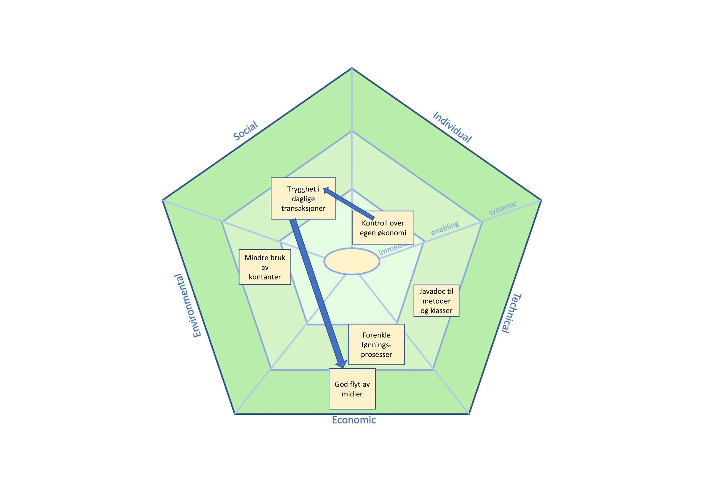

# Refleksjon over bærekraftsaspekter ved prosjektet
Bankapplikasjonen har flere forskjellige bærekraftsvirkninger. Denne dokumentasjonen vil følge Sus-AF modellen (Sustainability Awareness Framework).
Det vil si at den vil se på de sosiale, individuelle, økonomiske, tekniske og miljø-faktorene applikasjonen påvirker.

## Sosial-dimensjon
Bankapplikasjonen fremmer det sosiale aspektet ved SUSAF ved å gjøre det enkelt og trygt for brukere å overføre penger til hverandre via "Payment"-siden. Denne funksjonen bidrar til å styrke tilliten i daglige transaksjoner, da brukerne raskt kan bekrefte at pengene er overført mellom kontoene. Trygghetsaspektet fremmes ved at hver konto har et passord som må benyttes for å kunne logge inn. Dermed skapes en følelse av trygghet og enkelhet i økonomiske interaksjoner mellom personer.
## Individuell-dimensjon
Det individuelle aspektet ved SUSAF påvirkes i stor grad, ettersom bankapplikasjonen gir brukeren god kontroll over egen økonomi. Dette oppnås ved muligheten til å opprette egne kontoer, samt gjennom funksjonene "Deposit" og "Transfer". Med "Deposit" kan brukeren enkelt gjøre innskudd på egen konto – en prosess som i virkeligheten ville skjedd via en bankterminal eller lignende, men som her er forenklet i appen. "Transfer"-funksjonen gir brukeren full kontroll over hvordan midler fordeles mellom egne kontoer, noe som bidrar til bedre oversikt og fleksibilitet i egen økonomi.
Kontooversikten, "Overview", gir også et klart innblikk i egen økonomi, og man kan enkelt overføre, slette, og opprette kontoer hvor man oppbevarer midlene sine.
## Økonomisk-dimensjon
Bank-applikasjonen bidrar til økonomisk bærekraft ved å gjøre det enkelt for bedrifter og individer å gjøre enkle og effektive transaksjoner. For bedrifter økes effektiviteten ved forenkle lønningsprosessen for bedriftens ansatte.For individer blir daglige innkjøp og overføringer enklere. Alt i alt gjør dette at penger blir enklere og overføre, og skaper god flyt av midler fra individer til bedrift. Som et enkelt, og lett tilgjengelig verktøy bidrar applikasjonen til overgangen til en digital økonomi, og en inklusivt finansverdenen. 
## Teknisk-dimensjon
Applikasjonen har flere forskjellige egenskaper som fremmer god "maintainability". For det første har alle klasser og metoder javadoc, som gjør funksjonen av disse klar for utenforstående. Dette fremmer "maintainability" ved at fremtidige utviklere enkelt vil kunne forstå hensikten bak metoder, og hva de må returnere for at programmet skal fungere slik det skal. For det andre gjør oppdelingen i moduler livet enklere for utvikleren, da man kan begrense omfanget av avhengighet til de individuelle modulene. Det gjør at man, som utvikler, ikke trenger å sette seg inn i alle avhengighetene til hver modul før man begynner å utvikle. 
"Usability" fremmes ved at applikasjonen benytter et enkelt design, hvor det meste kun er ett eller to tastetrykk unna for brukeren. Det gjør at det er vanskelig for brukeren å sette seg fast i forskjellige sidemenyer, og at det alltid er en klar vei ut fra der man er. Dette aspektet fremmes også ved at applikasjonen gir brukeren tilbakemelding, i form av error-knappen, om hva de må endre for at applikasjonen skal fungere slik de ønsker.

## Miljø-dimenssjon
Bank applikasjonen vil kunne gi gode miljø-virkninger. Ved at økonomiske transaksjoner flyttes til digitale løsninger vil man kunne redusere mengden kontanter som sirkuleres. Det vil kunne føre til energi-besparing, da man vil slippe å transportere og produsere likes store mengder kontanter.

## Bærekraftsvirkninger i tabellformat
| ID | Virkning                         | Bærekraftsdimensjon | Nivå          | Påvirker | Påvirkes av |
|----|----------------------------------|---------------------|-------------- |----------|-------------|
| 1  | Kontroll over egen økonomi       | Individuell         | Umiddelbar    | 3        |             |
| 2  | God flyt av midler               | Økonomisk           | Systematisk   |          |2            |
| 3  | Trygghet i daglige transaksjoner | Sosial              | Muliggjørende |   2      | 1           |
| 4  | Forenkle lønningsprosess         | Økonomisk           | Muliggjørende |          |             |
| 5  | Mindre bruk av kontanter         | Miljø               | Umiddelbar    |          |             |
| 6  | Javadoc til metoder og klasser   | Teknisk             | Muliggjørende |          |             |

## SUSAD Diagram

 