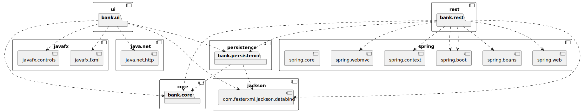

# Bank-prosjekt

[Åpne i Eclipse Che](https://che.stud.ntnu.no/#https://gitlab.stud.idi.ntnu.no/it1901/groups-2024/gr2422/gr2422?new)

Dette prosjektet er en bankapplikasjon utviklet i JavaFX som skal gi brukeren mulighet til å adminstrere sine bankkontoer. For mer innformasjon om hvordan appen fungerer, se [`bank/readme.md`](bank/readme.md).

## Struktur
Prosjektet bruker Maven for bygging og kjøring. 

Rotmappa til Maven-prosjektet er [`bank`](bank)-mappa og har følgende moduler: 
- [`core`](bank/core): Inneholder kode for kjernelogikken til applikasjonen. Kjernelogikken inneholder:
  -  **Bank-klasse**: Den har sentralt ansvar for å godkjenne alle transaksjoner og oppretting, sletting og endring av brukere eller kontoer, før det delegeres ned til nødvendige klasser. Det finnes kun en instans av banken. 
  - **User-klasse**: Den representerer en bruker av banken. Hver bruker har blant annet en tilhørende liste av bankkontoer og er unik basert på fødselsnummer (SSN). 
  - **Account-klasse**: Den representerer en bankkonto i banken. Hver konto i banken er unik basert på et kontonummer og har nødvendige metoder for uttak og inntak av penger. 

- [`ui`](bank/ui): Inneholder kode og ressurser for brukergrensesnittet til applikasjonen, som fxml-filer og kontrollerklasser. Dette er da applikasjonens front-end og inneholder da kontrollere og fxml-filer som støtter innlogging, registrering, sletting av bruker, oppretting og sletting av konto, betaling, overføring, uttak og inntak av penger. Ui-modulen får tilgang til banken via klassen UserAccess. UserAccess fungerer som bindeleddet mellom klienten og tjeneren og sender og behandler svar på HTTP-forespørsler til REST-serveren som ligger i rest-modulen.   
- [`persistence`](bank/persistence): Inneholder kode og ressurser for lagring og lesing av data til fil. Listen over User-objekter i Bank-instansen serialiseres og lagres som json. Data lagres under home directory på datamaskinen som REST-serveren startes på.  
- [`rest`](bank/rest): Inneholder kode for applikasjonens REST server og API. Rest-modulen består av følgende: 
  - **BankApplication-klasse**: Den har ansvar for å starte opp serveren.  
  - **BankService-klasse**: Dette er klassen for å definere nødvendigheter for Bank-serveren. Dette inneholder blant annet å  instansiere UserPersistence for håndtering av datalagring. 
  - **BankController-klasse**: Den har ansvar for å definere alle API-endepunkter og metoder. Dette blir da metodene som kalles når API-et kalles og må derfor inneholde metoder som støtter all funkjonalitet som front-end forventer. Dette er da alt av transaksjoner og endring av brukere og kontoer. 

*Pakkediagram av strukturen til Maven-prosjektet*

## Nødvendige versjoner
- Maven 3.9.9
- Java 17.0.12-tem

Kjør `mvn -version` for å verifisere at riktig versjon av Maven og Java er innstallert. Dersom versjonene er feil, kan det ikke garanteres at prosjektet kjøres. Får du feilmelding har du ikke installert dem riktig.

## Nyttige kommandoer
- Fra [`bank`](bank)-mappa kan du:
  - Kjøre `mvn clean` for å fjerne tidligere kompilert versjon.
  - Kjøre `mvn compile` for å kompilere kildekoden.
  - Kjøre `mvn test` for å kjøre testene. Dette vil også genere en rapport for testdekningsgrad, vha. `jacoco` ,som man finner i `target/site` i den aktuelle modulen.
  - Kjøre `mvn install` for å installere prosjektet lokalt.
  - Kjøre `mvn checkstyle:check` for å sjekke kodekvalitet i forhold til Google Java Style-standarden. Den kjøres også implisitt som en del av Mavens `verify`-fase. 
  - Kjøre `mvn spotbugs:spotbugs` for å sjekke etter mulige bugs i koden. Den kjøres også implisitt som en del av Mavens `verify`-fase.  
- Fra [`bank/ui`](bank/ui)-mappa kan du:
  - Kjøre `mvn javafx:run` for å starte appen (prosjektet må først installeres).
  - Kjøre `mvn javafx:jlink` for å generere runtime image av appen (prosjektet må først installeres). 
  - Kjøre `mvn jpackage:jpackage` for å generere installerbar pakke til appen (du må først generere runtime image).
- Fra [`bank/rest`](bank/ui)-mappa kan du:
  - Kjøre `mvn spring-boot:run` for å starte REST-serveren (prosjektet må først installeres).

- På kommandoer som kjører tester kan man legge til følgende: 
  - `-DheadlessTests` for å kjøre ui-tester i bakgrunnen
  - `-DskipUiTests` for å skippe ui-tester
  - `-DskipTests` for å skippe andre tester enn ui-tester

## Stegvis forklaring for kjøring

### 1. Innstaller prosjektet:
1. Kjør `cd bank` (gitt at du starter helt i rot).
2. Kjør `mvn clean install`.

Hvis du har gjort det riktig skal prosjektet nå innstalleres. 

### 2. Start server:
1. Kjør `cd rest` (gitt at du nå er i `bank`-mappen).
2. Kjør `mvn spring-boot:run`.

Hvis du har gjort det riktig skal serveren nå startes.  

### 3. Start klient:
1. Åpne nytt terminalvindu.
2. Kjør `cd bank/ui` (gitt at du starter helt i rot).
3. Kjør `mvn javafx:run`.

Hvis du har gjort det riktig skal appen nå startes. 

Alternativt er det laget en VSCode task ved navn `start` (den er satt som default build task og kan da kjøres med `ctrl+shift+b` hvis du ikke har endret snarveien) som vil installere og starte klient og server for deg. 